 
## CROSS PLATFORM DEVELOPMENT 
# WITH 
# [FIT] .NET CORE

 
**_Antoine Hémery 
Software Engineer - API Clients_**

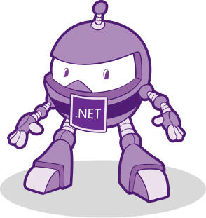

---

## _**.NET Framework Overview**_

---

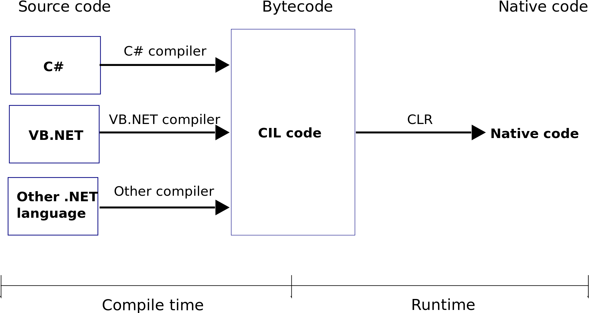

[.background-color: #FFFFFF]

---

## What people thinks the .NET Framework is

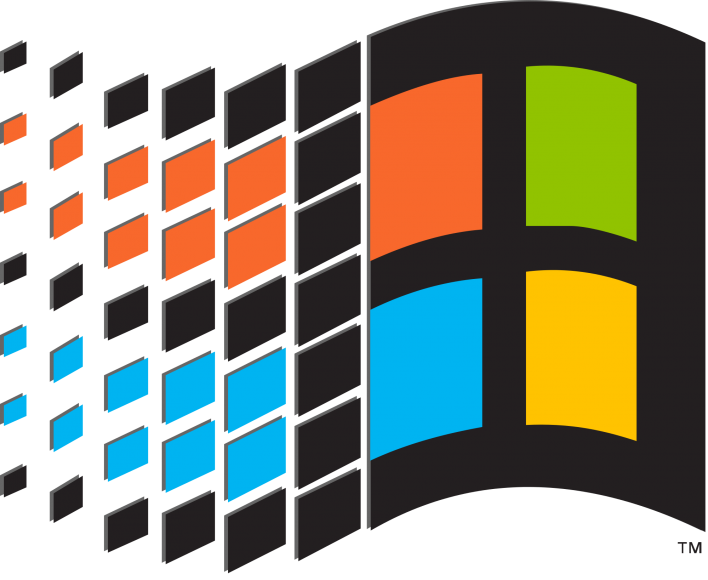
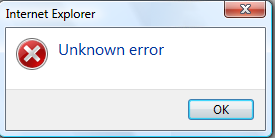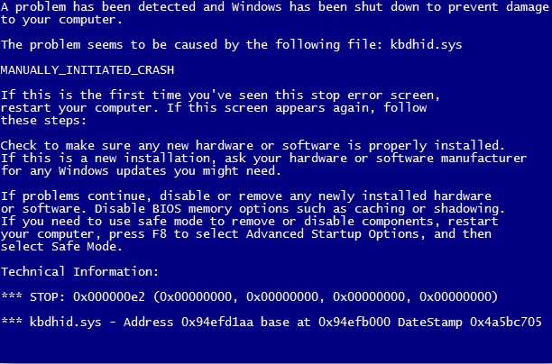

---

# What is .NET Core 
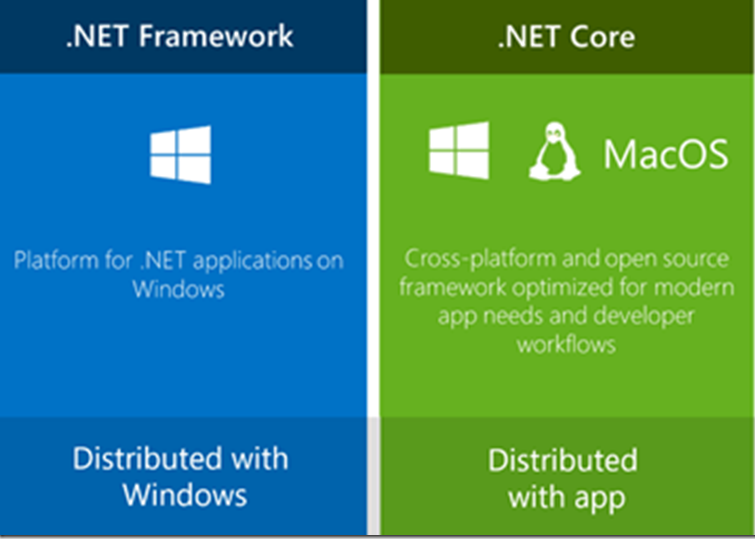 

---
[.background-color: #FFFFFF]

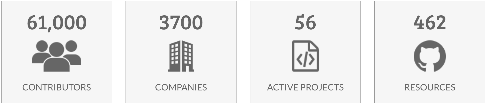
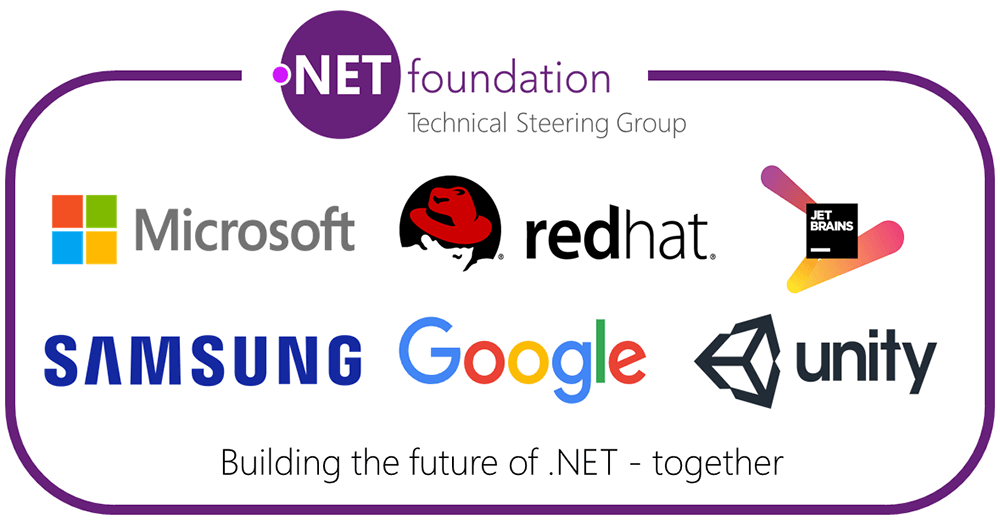

### **https://github.com/dotnet**

---

[.background-color: #FFFFFF]

## **.NET can run: WebApps - Desktop - Games - ML - IOT**

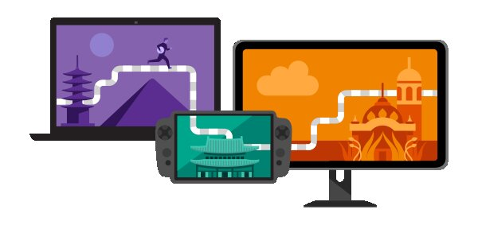
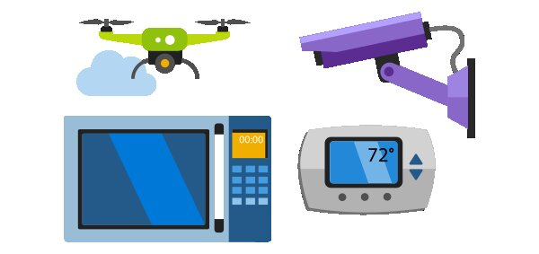

---
[.background-color: #FFFFFF]
# [fit] **.NET Core is used by industry leaders** 

---

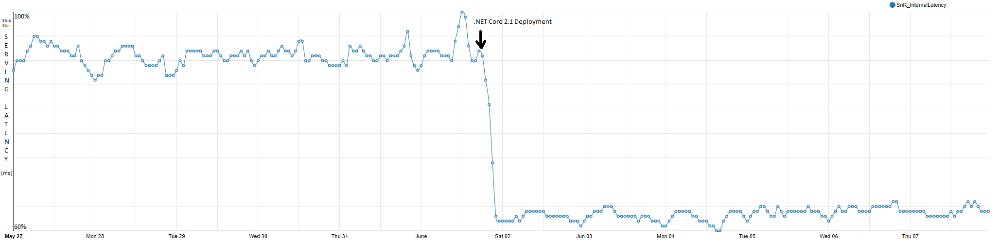

# [fit] .NET Core performance - Bing.com
 

---

# [FIT] Live coding
## 🤞 _**Fingers crossed**_ 🤞 

- **_1_**  .NET CLI and Console app
- **_2_**  .NET Rest API with Algolia library

---

# [FIT] Console App
## _**What did we learn?**_ 

- **_1_**  The .NET CLI
- **_2_**  How to create a .NET console project
- **_3_**  The IL code
- **_4_**  How to decompile a dll

---

# [FIT] .NET Rest API
## _**What did we learn?**_ 

- **_1_**  How to run a .NET WebServer
- **_2_**  How to use the Algolia C# library in a .NET app
- **_3_**  How to debug .NET on MacOS	

---

# [fit] Thanks!
# [fit] _**QUESTIONS?**_
Twitter: @Antoine_hy
Email: antoine.hemery@algolia.com

---
#[fit] References

- **_1_**  https://blogs.msdn.microsoft.com/dotnet/2018/08/20/bing-com-runs-on-net-core-2-1/
- **_2_**  https://dot.net
- **_3_**  https://github.com/dotnet
- **_4_**  https://dotnetfoundation.org

